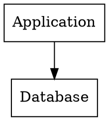
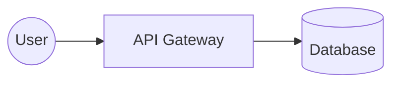

# Slidr

Markdown to styled HTML slides with PDF and ODP output.

## Why

Building a slide deck in PowerPoint is tedious. Writing markdown is fast.
Slidr turns markdown into slides. Content lives in markdown files. Styling
lives in CSS. No `.pptx` editing, no inline HTML, no copy-paste hell.

Other tools (Marp, Slidev) mix HTML and CSS into the markdown. This breaks
separation of concerns - your slides become `<div>` soup that's hard to
change later. Slidr keeps them apart: directives (`@kicker`, `@layout`,
`::: card`) are semantic; all styling is in theme CSS files.

Slidr is opinionated. It ships with card layouts, accent-colored quotes,
`▸` bullet markers, dark mode. You theme it via CSS variables. If you want
pixel-level custom layouts, use raw HTML. If you want a deck that looks
good out of the box with minimal markup, this is the one.

## Install

```bash
pdm install          # core + HTML/PDF/ODP
pdm install -G plot  # + seaborn/matplotlib for inline charts
```

## Usage

```bash
pdm run slidr slides.md              # HTML + presenter view
pdm run slidr slides.md --odp        # + ODP (programmatic)
pdm run slidr slides.md --image-odp  # + ODP (screenshots from PDF)
pdm run slidr slides.md --pdf        # + PDF
pdm run slidr -w slides.md           # watch and rebuild on changes
pdm run slidr --odp -w slides.md     # watch + ODP
```

`--image-odp` is the production-ready ODP path (PDF screenshot → images in ODP).
Pixel-perfect, always matches HTML output.

`--odp` uses a native ODF renderer (text, shapes, style registries). Currently
in progress: master page creation, font-face declarations, precise element
positioning. Known issues:

- Slide backgrounds use a cloned template master page instead of a fresh
  `StyleMasterPage` - works but carries template defaults
- Font-face `@font-face` registration fails due to an `odfdo` internal bug
- Vertical spacing and text alignment drift slightly from HTML

If you know the ODF spec or `odfdo` internals, contributions to the native ODP
renderer are welcome. See `src/slidr/render/odp.py` and `src/slidr/render/odf/`.

An Obsidian plugin that renders `.md` slides to HTML in-pane would be great.
The Python CLI makes distribution tricky; if you've tackled that problem
before, reach out.

Most of this codebase is AI-generated. I've kept it DRY where I could, but
there's still duplication - the lucide icon rendering appears in three places
that should be one, the table cell renderer has its own SVG path, etc. PRs
that consolidate repeated logic are welcome.

### Editing in PowerPoint / LibreOffice Impress

The best workflow for editable slides: build a PDF, open it in LibreOffice Draw,
select all slides, and paste into LibreOffice Impress (or export to PPTX):

```bash
pdm run slidr slides.md --pdf
libreoffice --draw slides.pdf        # Select All → Copy
libreoffice --impress                # Paste into new presentation
```

LibreOffice Draw preserves text, layout, and images from the PDF. This
avoids the positioning complexity of the native ODP renderer.

## Viewer controls

| Action | Key / Mouse |
|--------|-------------|
| Next slide | Left click (on slide area), Right arrow, Down arrow, PgDn, Space |
| Previous slide | Right click, Left arrow, Up arrow, PgUp, Backspace |
| First slide | Home |
| Last slide | End |
| Toggle fullscreen | `f` |
| Open presenter view | Presenter button, `p` |
| Close presenter | `q` |

## Slide directives

```
@kicker text           # title slide eyebrow
@subtitle text         # title slide subtitle
@speaker name=X role=Y # title slide attribution
@layout name           # apply a slide layout
@col                   # explicit column break in two-col / compare layouts
@row                   # horizontal row within a column (side by side)
@tiny text             # small annotation below content
@variant dark          # switch to dark mode for this slide
@hidden                # exclude slide from output (alias: @hide)
{icon:star}            # inline lucide icon, e.g. {icon:heart stroke=#d05a39}
```

## Layouts

| Layout | Usage |
|--------|-------|
| `@layout two-col` | Heading full-width, content split 50/50. Use `@col` for explicit break. |
| `@layout image-right` | Heading full-width, text left, image right |
| `@layout image-left` | Heading full-width, image left, text right |
| `@layout compare` | Two cards side-by-side with an arrow connector, conclusion notes below |
| Custom | `@layout <name>` adds CSS class `layout-<name>`, style via frontmatter `style:` block |

### Compare layout

```markdown
@layout compare

## Before & After

::: card{ tag="red" }
### Without HAMi

GPU utilization at 65%, manual bin-packing required.
:::

::: arrow

:::

::: card{ tag="green" }
### With HAMi

GPU utilization at 92%, zero manual intervention.
:::

::: notes{ tag="green" }
> HAMi is the only CNCF project providing hardware-level GPU sharing.
:::
```

The arrow block accepts text or images:
```
::: arrow
⚠
:::

::: arrow
{icon:arrow-right size=24}
:::
```

## Fenced blocks

```
::: grid {cols=2}              # responsive grid
::: grid {cols=3}              # 3-column grid
::: card                        # basic card
::: card{ tag="green" }         # colored left border + background
::: card{ tag="quote" }         # accent left border, italic, no fill
::: arrow                       # connector for compare layout
::: notes{ tag="green" }        # full-width conclusion card
> quote text                    # blockquote, renders as .quote div
| col1 | col2 |                 # pipe table
`inline code`                   # inline code
```language                    # fenced code block with syntax highlighting
```mermaid                     # Mermaid diagram, inline SVG
```seaborn                     # Seaborn chart, inline SVG
```dot                         # Graphviz diagram, inline SVG
```

## Lucide icons

Use `{icon:star}` anywhere inline - headings, paragraphs, tables, card
headers, card body, arrows, notes. Powered by `python-lucide`.

```
{icon:star}                              # default 1em height
{icon:check cls=accent-primary}          # uses theme accent via CSS class
{icon:heart cls=accent-secondary size=1.2em}  # class + explicit size
{icon:arrow-right size=32}               # pixel size
```

Parameters: `stroke`, `fill`, `width`, `height`, `size` (sets both), `cls` (CSS classes).

Use `cls=accent-primary`, `cls=accent-secondary`, or `cls=accent-contrast`
to match theme accent colors instead of hardcoded hex values.

No configuration needed - `pdm install` includes the dependency.

## Graphviz diagrams

Graphviz renders DOT language to SVG via the `dot` CLI. Requires `graphviz`
installed. Nodes use CSS classes matching slidr tag colors:

````markdown

````

Available node classes: `green`, `cyan`, `yellow`, `red`. Default nodes
use `var(--color-card-bg)`. To apply the card background to a cluster,
use `subgraph cluster_` prefix (e.g., `subgraph cluster_main`). CSS
cascades from the theme - dark mode applies automatically. Font inherits
from the CSS body font.

## Mermaid diagrams

````markdown

````

Renders inline SVG in HTML, PDF in ODP. Uses the `mermaidx` Python package.

## Seaborn charts

````markdown
```seaborn
tips = sns.load_dataset("tips")
sns.scatterplot(data=tips, x="total_bill", y="tip", hue="day")
```
````

Runs Python in-process, renders inline SVG. Requires `pdm install -G plot`.
Pre-imported: `sns`, `plt`, `pd`, `np`. Set `seaborn_theme: deep` in
frontmatter to change palette.

## Layout caveats

`@col` overrides auto-detection in all layouts. Use it when auto-split
puts content in the wrong column.

## Dark mode

Set `variant: dark` in frontmatter for all slides, or `@variant dark`
per slide:

```yaml
---
title: My Talk
variant: dark
---
```

```markdown
@variant dark

## This slide uses the dark theme
```

Per-slide overrides work as slideshow transitions: `@variant light` switches
back to light mode on the next slide.

## Theming

Colors, borders, and spacing use CSS custom properties. Override them via
frontmatter `style:` block or a custom theme file. See [THEMING.md](docs/THEMING.md)
for the full variable reference.

```yaml
---
style: |
  :root {
    --color-accent: #e91e63;
  }
---
```

## Speaker notes

Any HTML comment in a slide becomes speaker notes in the presenter view:

```markdown
---

<!--
These are speaker notes.
They appear in the presenter view.
-->
```

## Demo

`examples/features_demo.md` is a 17-slide deck exercising every feature:
title slides, `@layout two-col`, `@layout image-right`, `@layout compare`,
grids with tagged cards, tables, fenced code blocks, mermaid diagrams,
seaborn charts, graphviz graphs, lucide icons, blockquotes, speaker notes,
and all directives.

See also: `examples/mermaid_demo.md`, `examples/seaborn_demo.md`,
`examples/graphviz_demo.md`, `examples/lucide_demo.md`.

## Pipeline

```
slides.md
  → markdown-it-py (parse)
  → Document AST (headings, paragraphs, grids, cards, tables)
  → build_ir() (resolve theme styles via tinycss2)
  → SlideIR (font_size, color, accent, SVG/PDF, + rendered HTML)
     ↙              ↘            ↘
  html.py          odp.py      pdf.py
  (_render_elem)   (_render_elem)  (weasyprint)
                                    ↘
                              image_odp (pdftoppm → PNG → ODP)
```

The IR is the single source of truth between renderers. Each `Elem` carries
pre-rendered inline HTML (for the browser) plus resolved style properties
(font_size, color, accent, muted) for the ODP renderer. Seaborn and mermaid
SVGs are generated at IR build time and shared across renderers.

## Architecture decisions

### Why Python over Go

Go has no ODP library. No weasyprint equivalent. Goldmark works but its
plugin ecosystem is thin, and Go's compile cycle adds friction to design
work where you rebuild after every 2px change.

### Why Python over Rust

Rust comes closer than Go: pulldown-cmark handles markdown well, `cssparser`
does proper CSS parsing. But no odfdo equivalent, no weasyprint. Syntect
covers fewer languages than Pygments for syntax highlighting.

### Why not Node

Node slide tools ship a dev server, a bundler, a hot-reload daemon, and
usually Electron just to render markdown to `<div>` tags. Every dependency
adds a maintenance burden and expands the security surface. Python needs
weasyprint and odfdo. That's the stack.

### The Python sweet spot

- **odfdo**: ODP generation via OpenDocument XML
- **weasyprint**: HTML/CSS to PDF via embedded layout engine, no browser dependency
- **markdown-it-py**: same parser as the JS ecosystem, GFM support
- **Pygments**: comprehensive syntax highlighting for code blocks
- **Jinja2**: mature templating, CSS injection, template includes

Deployable as a single binary via PyInstaller or Nuitka when needed.

## License

GPL-3.0-or-later. See [LICENSE](LICENSE).

## Related projects

- [Marp](https://marp.app/) - Markdown to slides, JS/Electron, extensive ecosystem
- [Slidev](https://sli.dev/) - Markdown to slides, Vue/Node, presenter mode, rich theming
- [reveal.js](https://revealjs.com/) - HTML presentation framework, JS
- [landslide](https://github.com/adamzap/landslide) - Markdown to slides, Python, dormant
- [lookatme](https://github.com/d0c-s4vage/lookatme) - Terminal markdown presentations, Python
