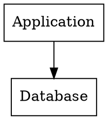
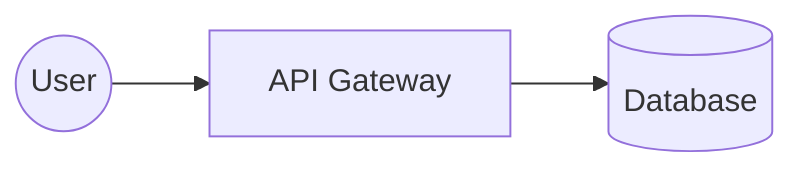

# Slidr

Markdown to styled HTML slides with PDF and ODP output.

## Why

AI models are great at generating text but terrible at generating editable
presentations. Asking an LLM to "make a slide deck" gives you a PPTX file
with locked layouts, broken fonts, and content you can't easily tweak.

Slidr inverts this: AI writes markdown (which it's excellent at), Slidr
renders it to professionally styled slides. You edit the markdown -- the
slides update automatically. Designer changes go in CSS, content changes
go in markdown, never in a `.pptx` file.

The result: AI-driven content generation plus human-editable output.
Write once in markdown, render to HTML, PDF, and ODP from a single source.

Other markdown-to-slide tools (like Marp) require inline HTML and CSS
sprinkled throughout the markdown to achieve styled layouts. This breaks
the separation of content and design -- your slides become uneditable
messes of `<div>` tags and `style` attributes. Slidr uses directives
(`@kicker`, `@layout`, `::: card`) that stay clean and semantic. All
styling lives in CSS themes, completely separate from your content.

## Install

```bash
pdm install          # core + HTML/PDF/ODP
pdm install -G plot  # + seaborn/matplotlib for inline charts
```

## Usage

```bash
pdm run slidr slides.md              # HTML + presenter view
pdm run slidr slides.md --odp        # + ODP (programmatic)
pdm run slidr slides.md --image-odp  # + ODP (screenshots from PDF)
pdm run slidr slides.md --pdf        # + PDF
pdm run slidr -w slides.md           # watch and rebuild on changes
pdm run slidr --odp -w slides.md     # watch + ODP
```

The `--image-odp` flag renders each slide as a PNG screenshot from the PDF output
and embeds them in an ODP file. Pixel-perfect, always matches HTML. The `--odp`
flag uses a programmatic renderer with native ODF text and styling.

### Editing in PowerPoint / LibreOffice Impress

The best workflow for editable slides: build a PDF, open it in LibreOffice Draw,
select all slides, and paste into LibreOffice Impress (or export to PPTX):

```bash
pdm run slidr slides.md --pdf
libreoffice --draw slides.pdf        # Select All → Copy
libreoffice --impress                # Paste into new presentation
```

LibreOffice Draw preserves text, layout, and images from the PDF. This
avoids the positioning complexity of the native ODP renderer.

## Viewer controls

| Action | Key / Mouse |
|--------|-------------|
| Next slide | Left click (on slide area), Right arrow, Down arrow, PgDn, Space |
| Previous slide | Right click, Left arrow, Up arrow, PgUp, Backspace |
| First slide | Home |
| Last slide | End |
| Toggle fullscreen | `f` |
| Open presenter view | Presenter button, `p` |
| Close presenter | `q` |

## Slide directives

```
@kicker text           # title slide eyebrow
@subtitle text         # title slide subtitle
@speaker name=X role=Y # title slide attribution
@layout name           # apply a slide layout
@col                   # explicit column break in two-col / compare layouts
@tiny text             # small annotation below content
@variant dark          # switch to dark mode for this slide
```

## Layouts

| Layout | Usage |
|--------|-------|
| `@layout two-col` | Heading full-width, content split 50/50. Use `@col` for explicit break. |
| `@layout image-right` | Heading full-width, text left, image right |
| `@layout image-left` | Heading full-width, image left, text right |
| `@layout compare` | Two cards side-by-side with an arrow connector, conclusion notes below |
| Custom | `@layout <name>` adds CSS class `layout-<name>`, style via frontmatter `style:` block |

### Compare layout

```markdown
@layout compare

## Before & After

::: card{ tag="red" }
### Without HAMi

GPU utilization at 65%, manual bin-packing required.
:::

::: arrow

:::

::: card{ tag="green" }
### With HAMi

GPU utilization at 92%, zero manual intervention.
:::

::: notes{ tag="green" }
> HAMi is the only CNCF project providing hardware-level GPU sharing.
:::
```

The arrow block accepts text or images:
```
::: arrow
⚠
:::

::: arrow

:::
```

## Fenced blocks

```
::: grid {cols=2}              # responsive grid
::: grid {cols=3}              # 3-column grid
::: card                        # basic card
::: card{ tag="green" }         # colored left border + background
::: card{ tag="quote" }         # accent left border, italic, no fill
::: arrow                       # connector for compare layout
::: notes{ tag="green" }        # full-width conclusion card
> quote text                    # blockquote, renders as .quote div
| col1 | col2 |                 # pipe table
`inline code`                   # inline code
```language                    # fenced code block with syntax highlighting
```mermaid                     # Mermaid diagram, inline SVG
```seaborn                     # Seaborn chart, inline SVG
```dot                         # Graphviz diagram, inline SVG
```

## Graphviz diagrams

Graphviz renders DOT language to SVG via the `dot` CLI. Requires `graphviz`
installed. Nodes use CSS classes matching slidr tag colors:

````markdown

````

Available node classes: `green`, `cyan`, `yellow`, `red`. Default nodes
use `var(--color-card-bg)`. To apply the card background to a cluster,
use `subgraph cluster_` prefix (e.g., `subgraph cluster_main`). CSS
cascades from the theme -- dark mode applies automatically. Font inherits
from the CSS body font.

## Mermaid diagrams

````markdown

````

Renders inline SVG in HTML, PDF in ODP. Uses the bundled `mmdc` Python package.

## Seaborn charts

````markdown
```seaborn
tips = sns.load_dataset("tips")
sns.scatterplot(data=tips, x="total_bill", y="tip", hue="day")
```
````

Runs Python in-process, renders inline SVG. Requires `pdm install -G plot`.
Pre-imported: `sns`, `plt`, `pd`, `np`. Set `seaborn_theme: deep` in
frontmatter to change palette.

## Layout caveats

`@col` overrides auto-detection in all layouts. Use it when auto-split
puts content in the wrong column.

## Dark mode

Set `variant: dark` in frontmatter for all slides, or `@variant dark`
per slide:

```yaml
---
title: My Talk
variant: dark
---
```

```markdown
@variant dark

## This slide uses the dark theme
```

Per-slide overrides work as slideshow transitions: `@variant light` switches
back to light mode on the next slide.

## Theming

Colors, borders, and spacing use CSS custom properties. Override them via
frontmatter `style:` block or a custom theme file. See [THEMING.md](docs/THEMING.md)
for the full variable reference.

```yaml
---
style: |
  :root {
    --color-accent: #e91e63;
  }
---
```

## Speaker notes

Any HTML comment in a slide becomes speaker notes in the presenter view:

```markdown
---

<!--
These are speaker notes.
They appear in the presenter view.
-->
```

## Demo

`examples/features_demo.md` is a 15-slide deck exercising every feature:
title slides, `@layout two-col`, `@layout image-right`, `@layout compare`,
grids with tagged cards, tables, fenced code blocks, mermaid diagrams,
seaborn charts, graphviz graphs, blockquotes, speaker notes, and all directives.

See also: `examples/mermaid_demo.md`, `examples/seaborn_demo.md`,
`examples/graphviz_demo.md`.

## Pipeline

```
slides.md
  → markdown-it-py (parse)
  → Document AST (headings, paragraphs, grids, cards, tables)
  → build_ir() (resolve theme styles via tinycss2)
  → SlideIR (font_size, color, accent, SVG/PDF, + rendered HTML)
     ↙              ↘            ↘
  html.py          odp.py      pdf.py
  (_render_elem)   (_render_elem)  (weasyprint)
                                    ↘
                              image_odp (pdftoppm → PNG → ODP)
```

The IR is the single source of truth between renderers. Each `Elem` carries
pre-rendered inline HTML (for the browser) plus resolved style properties
(font_size, color, accent, muted) for the ODP renderer. Seaborn and mermaid
SVGs are generated at IR build time and shared across renderers.

## Architecture decisions

### Why Python over Go

Go's ecosystem is thin for presentation tooling. Generating ODP requires a library like odfdo, and Go has nothing comparable. Rendering HTML to PDF needs a real layout engine: weasyprint embeds one in a single Python package; Go would require shelling out to wkhtmltopdf or headless Chrome, both hundreds of megabytes. Markdown parsing has goldmark but its plugin ecosystem is smaller than markdown-it-py. The project iterates heavily on CSS rules, padding math, and layout logic, and Go's compile cycle adds friction to design work where you rebuild after every 2px change.

### Why Python over Rust

Same ecosystem gap, worse compile times. Rust has no odfdo equivalent, no weasyprint equivalent. Pygments for syntax highlighting has syntect in Rust but syntect covers fewer languages. Jinja2 templating maps to Tera which is less mature. Rust's compile time is measured in seconds where Python's is milliseconds, and slide design is inherently iterative.

### Why not Node

Node's dependency footprint is the dealbreaker. A CLI that parses markdown, generates ODP, renders PDF, and templates HTML pulls in 300MB+ of node_modules for marginal functionality. PDF generation requires Puppeteer/Playwright, which bundles a headless Chromium binary (~300MB). Weasyprint is a single Python package that does the same with a fraction of the weight. ODP libraries in Node are less mature than odfdo. Python's stdlib covers path handling, subprocess management, and file I/O without extra packages. The result is a tool you can install and run without downloading half the internet.

### The Python sweet spot

- **odfdo**: ODP generation via OpenDocument XML
- **weasyprint**: HTML/CSS to PDF via embedded layout engine, no browser dependency
- **markdown-it-py**: same parser as the JS ecosystem, GFM support
- **Pygments**: comprehensive syntax highlighting for code blocks
- **Jinja2**: mature templating, CSS injection, template includes
- **Edit-test cycle**: no compile step, instant feedback when tweaking layouts

Deployable as a single binary via PyInstaller or Nuitka when needed.

## License

GPL-3.0-or-later. See [LICENSE](LICENSE).

## Related projects

- [Marp](https://marp.app/) - Markdown to slides, JS/Electron, extensive ecosystem
- [Slidev](https://sli.dev/) - Markdown to slides, Vue/Node, presenter mode, rich theming
- [reveal.js](https://revealjs.com/) - HTML presentation framework, JS
- [landslide](https://github.com/adamzap/landslide) - Markdown to slides, Python, dormant
- [lookatme](https://github.com/d0c-s4vage/lookatme) - Terminal markdown presentations, Python
