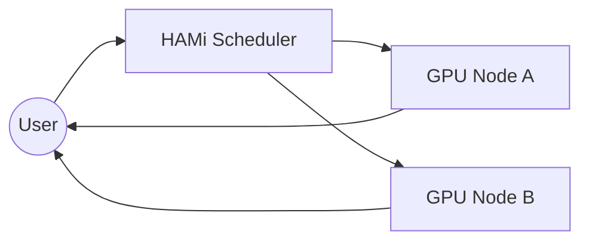

@kicker v2.6 · July 2026

# HAMi

@subtitle Hardware Affinity Manager for Inference

@speaker name="Reza Jelveh" role="Engineering · Dynamia"

<!--
Welcome to the HAMi demo. This deck showcases all slidr features: layouts, grids, cards, tables, quotes, speaker notes, and the new @layout directive.
-->

---

## Agenda

::: grid {cols=2}
::: card{ tag="green" }
### Architecture

How HAMi schedules GPU workloads across heterogeneous clusters
:::

::: card{ tag="cyan" }
### Deployment

Single-node to multi-cluster scaling patterns
:::

::: card{ tag="yellow" }
### Performance

Benchmarks: throughput, latency, GPU utilization
:::

::: card{ tag="red" }
### Roadmap

Q3 2026 priorities and community contributions
:::
:::

::: card
> HAMi reduces GPU fragmentation by 40% in production inference clusters
:::

---

@layout image-right

## GPU Scheduling Architecture

HAMi intercepts CUDA API calls at the library level to enable fine-grained GPU sharing. The scheduler runs as a Kubernetes device plugin and supports MIG, MPS, and time-slicing for NVIDIA GPUs.

- Device plugin registers GPU resources per node
- HAMi-core intercepts `cuInit`, `cuMemAlloc`, `cuLaunchKernel`
- Scheduler bins workloads by memory footprint and priority
- Fractional GPU allocation down to 1% granularity


<!--
Key point: the library-level interception means zero container modification. Just mount the HAMi lib and set resource limits.
-->

---

@layout image-left

## Performance Benchmarks


HAMi demonstrates near-linear scaling with concurrent inference workloads across 8× A100 GPUs. The key metric is GPU utilization efficiency -- HAMi achieves 92% average utilization vs. 65% baseline with default Kubernetes scheduling.

- 3.2× throughput improvement on BERT-large inference
- < 2% latency overhead from CUDA interception
- 40% reduction in GPU idle time across the cluster
- Supports mixed-precision (FP16/BF16/INT8) workloads

---

@layout two-col

## Deployment Patterns

**Standalone**: Single binary with embedded etcd, suitable for edge inference
- **Kubernetes Native**: Helm chart with device plugin, custom scheduler, and CRDs
- **Multi-Cluster**: Federation via HAMi-gateway with cross-cluster GPU sharing
- **Air-Gapped**: Offline mode with signed container images and local model registry


**Monitoring**: Prometheus metrics for GPU utilization, memory pressure, scheduling latency
- **Autoscaling**: HPA integration based on GPU queue depth and pending workload count
- **Security**: OPA/Gatekeeper policies for GPU resource quotas and tenant isolation

<!--
The two-col layout auto-splits content after the heading. First half goes left, second half goes right.
-->

---

## Resource Specification

| Resource | Minimum | Recommended | Maximum |
|----------|---------|-------------|---------|
| GPUs per node | 1 | 8 | 16 |
| GPU memory (GB) | 4 | 40 | 80 |
| CPU cores | 2 | 8 | 32 |
| System RAM (GB) | 8 | 64 | 512 |
| Nodes per cluster | 1 | 10 | 100 |
| Concurrent workloads | 1 | 50 | 200 |

> HAMi supports all NVIDIA GPUs from T4 to H100, plus upcoming B200 Blackwell architecture

---

## Community & Ecosystem

::: card{ tag="green" }
### CNCF Sandbox

Accepted Q1 2026. Currently in incubation review with 12 maintainers across 6 organizations.
:::

::: card{ tag="cyan" }
### Integrations

Native support for PyTorch, TensorFlow, vLLM, TGI, Ollama. One-click integration with KServe and Ray Serve.
:::

::: card{ tag="yellow" }
### Contributors

850+ GitHub stars, 120 contributors, monthly community calls, Slack with 2k+ members.
:::

::: card{ tag="red" }
### Enterprise

Production deployments at ByteDance, Alibaba Cloud, Xiaohongshu, and 15+ Fortune 500 companies.
:::

<!--
The grid system auto-detects 2×2 cards and places them in a responsive grid. Cards with tags get colored left borders.
-->

---

## Enterprise vs Open Source

| Feature | Open Source | Enterprise |
|---------|------------|------------|
| GPU sharing | ✓ | ✓ |
| Fractional GPU | ✓ | ✓ |
| MIG support | ✓ | ✓ |
| Multi-cluster federation | - | ✓ |
| SSO / RBAC | - | ✓ |
| Audit logging | - | ✓ |
| SLA guarantee | - | ✓ |
| 24/7 support | Community | Dedicated |
| License | Apache 2.0 | Commercial |

---

## Quick Start

```bash
# Install HAMi via Helm
helm repo add hami https://project-hami.github.io/charts
helm install hami hami/hami \
  --set devicePlugin.version=v2.6.0 \
  --set scheduler.enabled=true

# Submit a GPU workload
kubectl apply -f - <<EOF
apiVersion: v1
kind: Pod
metadata:
  name: inference-test
spec:
  containers:
  - name: bert
    image: hami-demo/bert-inference:latest
    resources:
      limits:
        nvidia.com/gpu: 1
        nvidia.com/gpumem: 8000
EOF
```

@tiny HAMi v2.6 supports fractional GPU with memory limits in MiB

<!--
This slide shows a code block. The @tiny directive renders small annotation text below the code.
-->

---

## GPU Utilization Trends

```seaborn
df = pd.DataFrame({
    "Quarter": ["Q1", "Q1", "Q2", "Q2", "Q3", "Q3"],
    "Cluster": ["Baseline", "HAMi", "Baseline", "HAMi", "Baseline", "HAMi"],
    "Utilization": [65, 78, 62, 85, 68, 92],
})
sns.barplot(data=df, x="Quarter", y="Utilization", hue="Cluster")
```

---

@layout two-col

## Scheduling Flow

HAMi routes GPU requests through device plugins, custom scheduling, and
library-level CUDA interception. The hot path (inference) bypasses the
scheduler entirely after initial placement.

@col



---

## Key Takeaways

::: grid {cols=3}
::: card
### Zero-Downtime

Live migration of GPU workloads between nodes without service interruption
:::

::: card
### Cost Efficiency

Reduce GPU costs by 40-60% through intelligent bin-packing and fractional allocation
:::

::: card
### Open Standard

Apache 2.0 license, vendor-neutral governance, CNCF-hosted project infrastructure
:::

---

@kicker Questions

# Thank You


@speaker name="Reza Jelveh" role="reza@dynamia.io"
