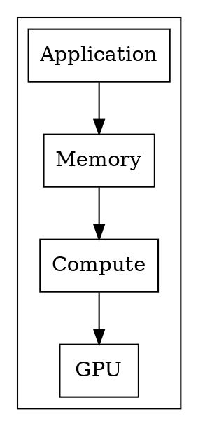
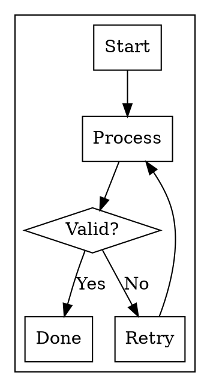
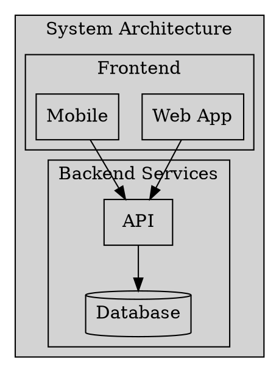
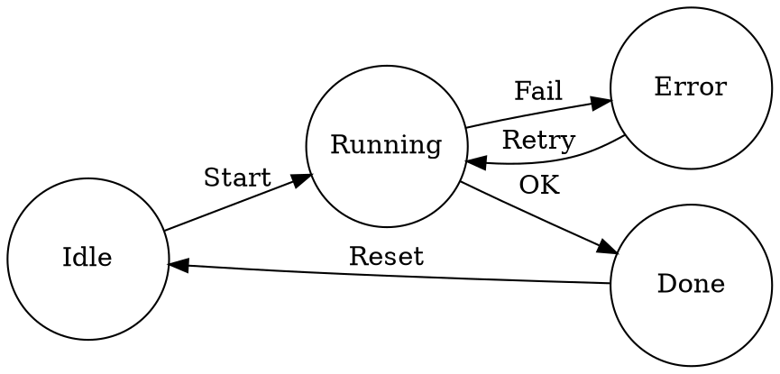

# Graphviz

@kicker Declarative graph rendering with dot

@speaker name="Slidr" role="Text-to-graph rendering"

---

## Architecture

@layout two-col

Graphviz renders directed and undirected
graphs from DOT language descriptions.
Nodes and edges are auto-positioned by
the layout engine.

- Hierarchical layouts
- Cluster subgraphs
- CSS class inheritance
- Theme color variables

@col

---

## Flowchart

@layout two-col

Flowcharts use decision diamonds and
process boxes with directional edges
to show logic flow.

- Box shapes for processes
- Diamond shapes for decisions
- Edge labels for branches

@col

---

## Cluster Diagram

---

## State Machine

@layout two-col

State machines model system behavior
with states and transitions. Each state
is a node with specific styling.

@col

