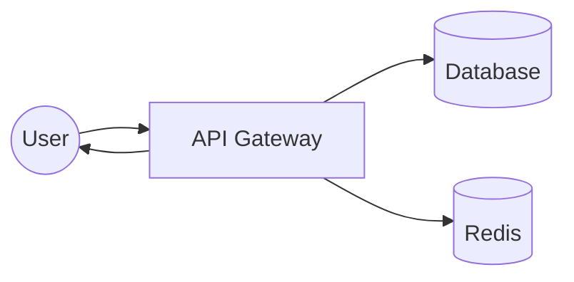
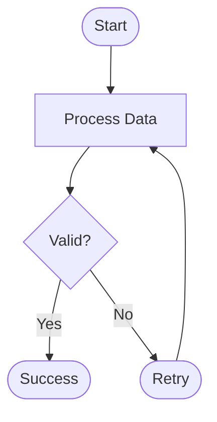
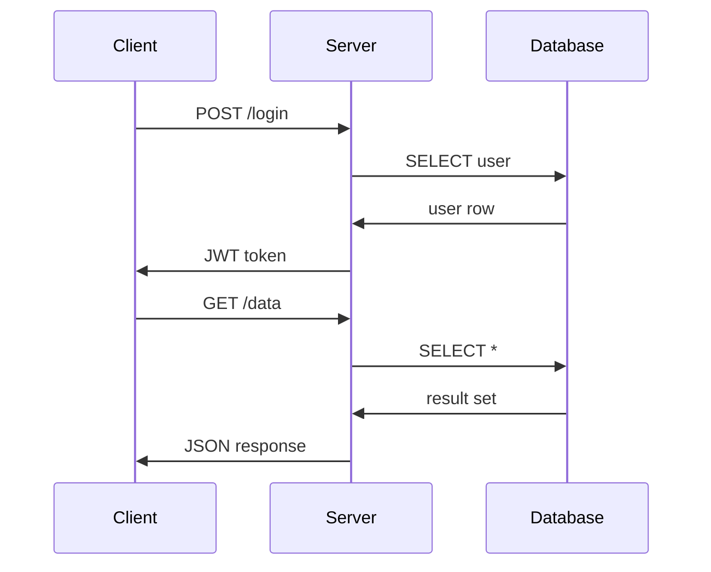
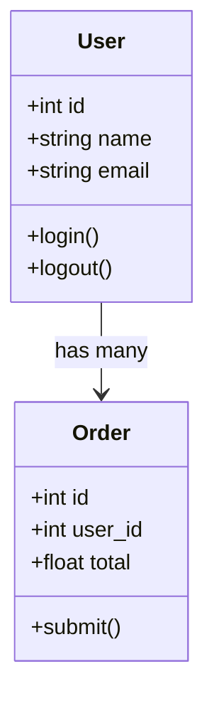
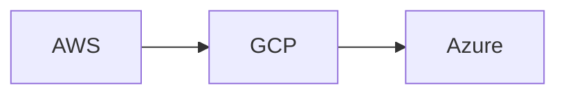
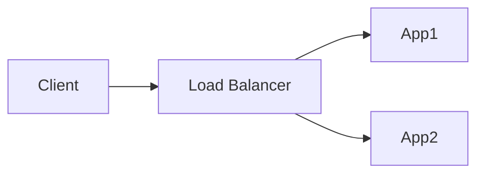

# Mermaid

@kicker Declarative diagramming from text

@speaker name="Slidr" role="Text-to-diagram rendering"

---

## Architecture

---

## Flowchart

---

## Sequence

---

## Class Diagram

---

## Grid Layout

@layout two-col

@col

